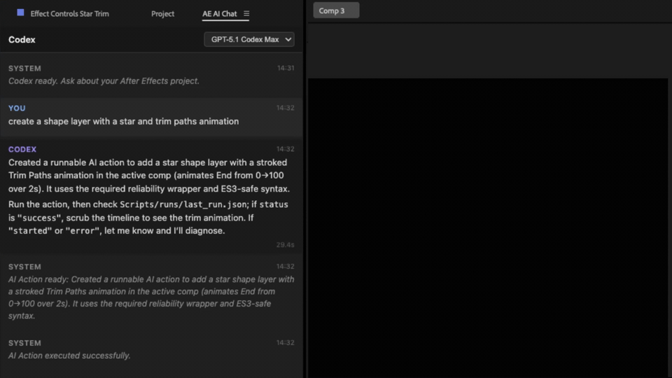
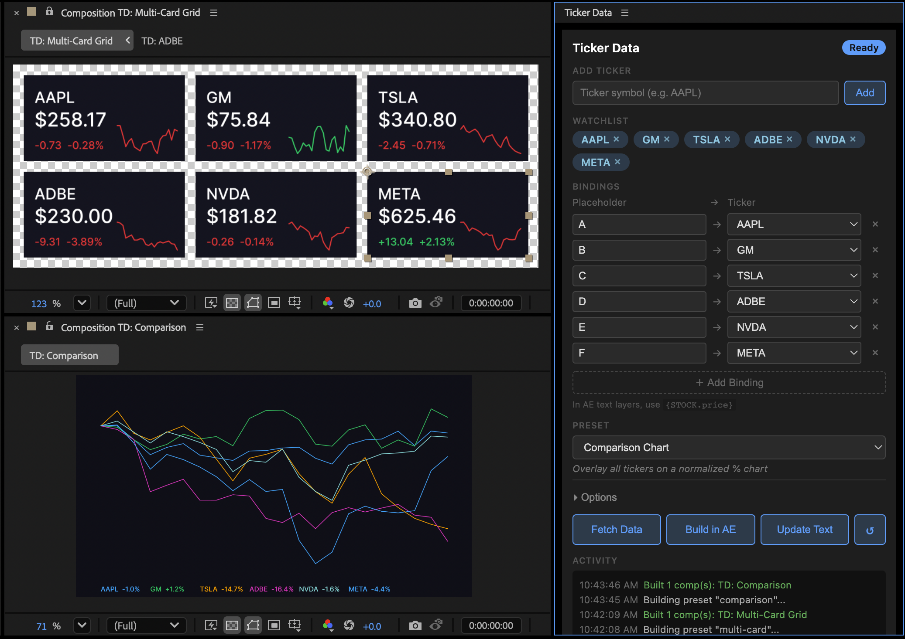

# After Effects AI Starter

Automate After Effects with AI — describe what you want in plain language to an LLM and have it actually do stuff in AE.

## Quick Start

**Requirements:** After Effects (any recent version) + an AI assistant ([Claude Code](https://claude.ai/download), ChatGPT, Cursor, Gemini, etc.)

1. Clone this repo or click **Use this template** on GitHub
2. Open your After Effects project (`.aep`)
3. Run `Scripts/setup.jsx` via **File > Scripts > Run Script File**
   - The setup dialog will ask for your project name, main composition, and whether to create a UI panel
4. Open your AI assistant and follow **[Your First Automation](docs/first-automation.md)**

That's it. Your AI now knows your compositions, layers, and properties — ask it to automate anything.

> **Try:** *"Change all text layers in my main comp to use the font Helvetica Neue"*

## How It Works

1. **Setup scans your project** — generates a report so the AI knows exactly what's in your AE file (compositions, layers, properties)
2. **You describe what you want** — in plain language, no scripting knowledge required
3. **AI writes a script** — using your project's actual layer names and property paths
4. **You run it in AE** — via File > Scripts, or a button on your custom panel

When your AE template changes, re-run `Scripts/analyze/run_analysis.jsx` to keep the report current.

## Examples

| Example | What It Shows |
|---------|---------------|
| [social-card](examples/social-card/) | Data-driven social card with dynamic text and images |
| [ticker-data](examples/ticker-data/) | Live stock data pulled into a lower-third panel |
| [audio-spectrum](examples/audio-spectrum/) | Generative audio visualizer panel |

## Screenshots

## Learn More

- **[Your First Automation](docs/first-automation.md)** — Step-by-step walkthrough from setup to first script
- **[AI Workflow Guide](docs/ai-workflow.md)** — Advanced tips, symlink patterns, and development practices
- **[Recipes Reference](docs/recipes.md)** — When to use each recipe and how to customize them
